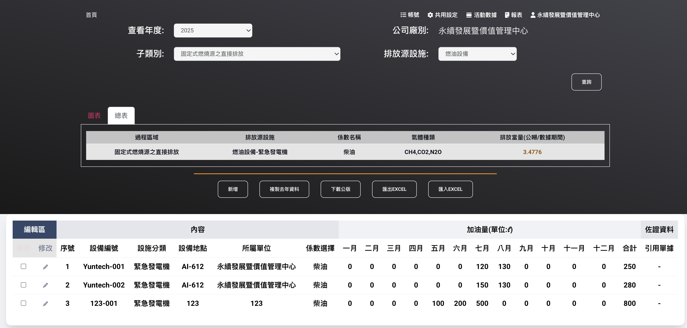
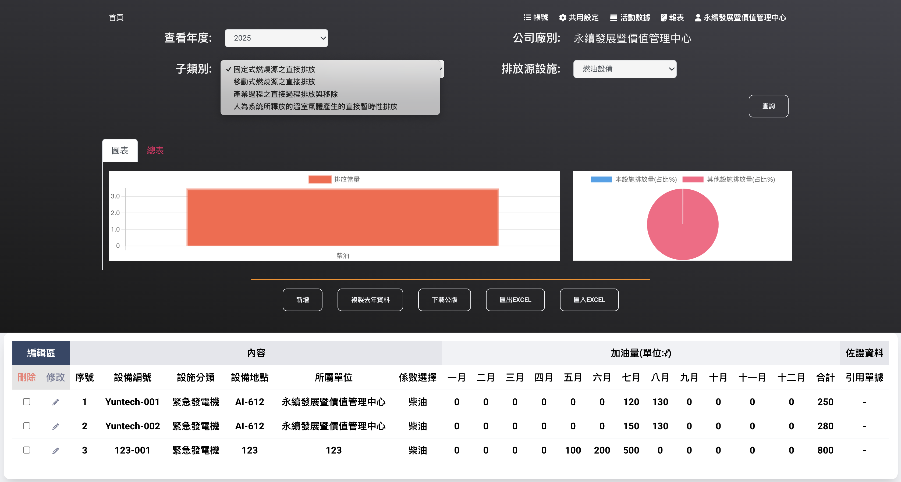
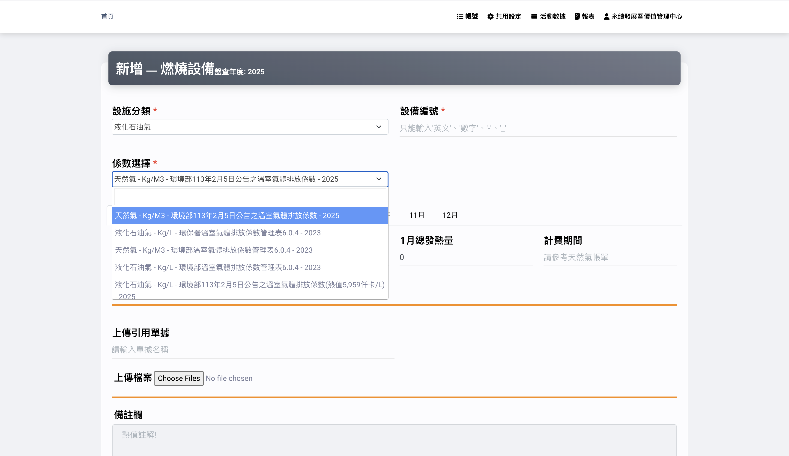
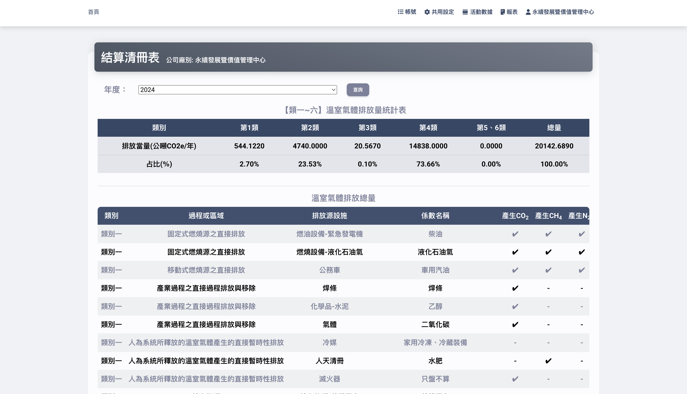
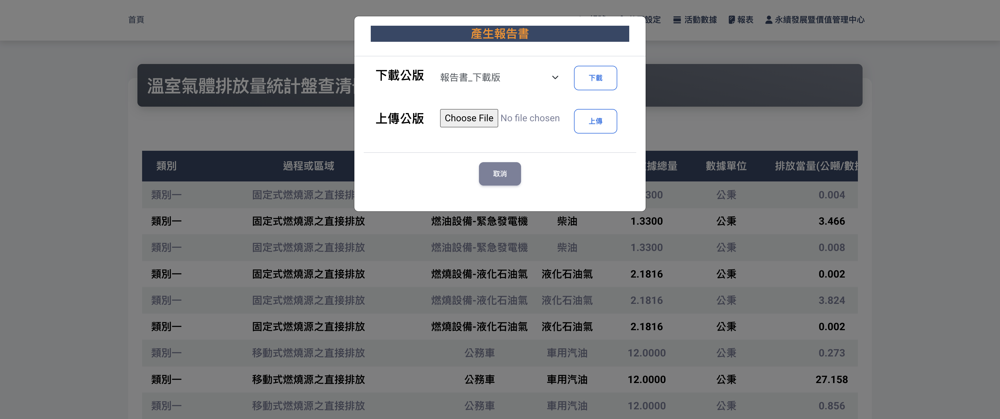
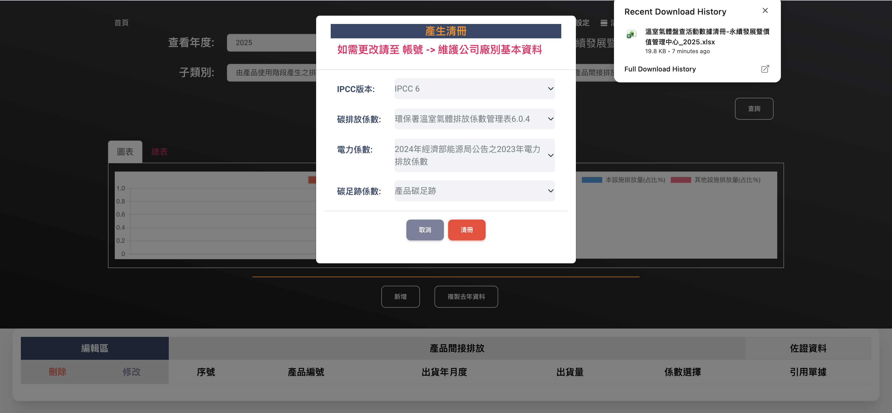

# 🌱🌎 Carbon Emission Inventory System

A Django-based system designed to help organizations manage carbon emission inventory data, supporting standardized carbon accounting, compliance, and audit reporting.

## 🚀 Features

- Record and manage carbon emission inventory data  
- Online data entry (records, images, text)  
- Emission calculation based on GHG Protocol, ISO 14064-1, and ISO 14067  
- Import and export data via CSV  
- Generate reports for audit and compliance  
- Centralized system for tracking emission-related information  

## 🛠 Tech Stack

- Python 3.7
- Django 3.2
- MariaDB 
- Pandas (data processing)
- HTML / CSS / JavaScript / Bootstrap

## 📁 Project Structure

```text
carbon-emission-inventory-system/
├── apps/                 # Django apps, templates, static files, and business logic
├── core/                 # Django settings, URLs, and WSGI configuration
├── media/                # Project media/images
├── env.sample            # Example environment variables
├── manage.py             # Django command-line utility
├── requirements.txt      # Python dependencies
└── README.md
```

## 📸 Screenshots

### 📊 Dashboard
<p align="center">
  
</p>
<p align="center">
  
</p>

### 📝 Emission Entry Form
<p align="center">
  
</p>

### 📈 Summary Table
<p align="center">
  
</p>

### 📄 Report Generation and Export
<p align="center">
  
</p>

<p align="center">
  
</p>
